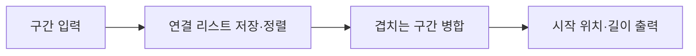

# 자료구조·알고리즘 구현

2020년 **전자공학을 위한 자료구조·알고리듬**에서 C++로 객체 관리, 연결 리스트, 탐색 트리와 경로 탐색을 구현했습니다. 자료구조의 연산과 메모리 연결을 직접 다루고, 개인 tester로 연산 결과를 확인했습니다.

| 프로젝트 | 구현 내용 |
|---|---|
| 학생 정보 관리 | 상속·다형성과 조회, 문자열 유사도 비교 |
| 구간 병합 | 연결 리스트에 구간을 저장하고 정렬·병합 |
| 탐색 트리 | BST·Red-Black Tree의 검색·삽입·삭제와 개인 tester |
| 경로 탐색 | 그래프에서 Dijkstra·A* 탐색 |

## 구간 병합 실행 예시

각 입력 행은 `시작 위치 길이`입니다. 서로 겹치는 첫 두 구간은 하나로 합치고, 떨어진 구간은 유지합니다.

| 입력 | 실행 출력 |
|---|---|
| `0 3` `2 4` `10 2` | `0 6` `10 2` |

## 트리와 경로 탐색

BST·Red-Black Tree는 노드 삽입·삭제에 따른 연결 변경과 자료구조의 조건 유지를 구현했습니다. 추가로 작성한 개인 tester로 검색·삽입·삭제를 확인했습니다. Dijkstra와 A*에서는 누적 비용과 목표까지의 추정 비용이 탐색 순서에 미치는 차이를 다뤘습니다.

| 확인 항목 | 실행·검사 범위 |
|---|---|
| 구간 병합 | 위 입력에 대해 출력 일치 |
| 탐색 트리 | 개인 tester의 범위 인자 3 실행 완료 |
| 학생 정보 관리 | 빈 문자열·한 글자·bigram 중복·유사도 경계·파생 객체 소멸 검사 |
| 경로 탐색 | C++ 객체 파일 컴파일 |

교과 skeleton과 인터페이스를 확장한 구현입니다. 구간 병합과 개인 tester 실행은 Windows의 Zig C++ 컴파일러 환경에서 확인했습니다.
