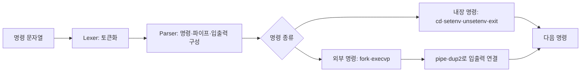

# C·Unix 셸 구현

2019년 가을 **전자공학을 위한 프로그래밍 구조(EE209)**에서 C의 포인터·메모리 관리와 Unix 프로세스 제어를 학습했습니다. 텍스트 처리·고객 정보 관리·assembly 계산기를 구현한 뒤, 명령 해석과 프로세스 실행을 연결하는 셸로 확장했습니다.

## 셸의 처리 구조

`lexer.c`에서 입력 문자열을 토큰화하고 `parser.c`에서 실행할 명령과 입출력 관계를 해석했습니다. `ish.c`는 자식 프로세스를 만들고 외부 프로그램을 실행합니다. 여러 명령의 연결에는 파이프를, 파일 입출력에는 파일 디스크립터 재지정을 사용했습니다. SIGINT·SIGQUIT·SIGALRM의 동작과 시작 설정 파일 `.ishrc`도 처리했습니다.

## 함께 구현한 프로그램

| 프로그램 | 구현 내용 |
|---|---|
| C 주석 처리·문자 수 계산 | DFA로 주석과 일반 문자열을 구분하고 줄·단어·문자 집계 |
| 문자열 도구 | 포인터 기반 문자열 함수, 검색·치환·파일 비교 |
| 고객 정보 DB | 배열·연결 리스트·해시 테이블 구현, ID·이름 조회와 등록·삭제 |
| RPN 계산기 | 32-bit x86 assembly로 스택 기반 연산 |

교과 skeleton과 인터페이스를 바탕으로 구현했습니다. DynArray와 lexer의 기반 예제는 수업 제공 모듈을 사용했습니다. 유지관리 소스의 C 파일 10개와 assembly 파일 1개는 Linux 대상 객체 파일로 컴파일했습니다.
